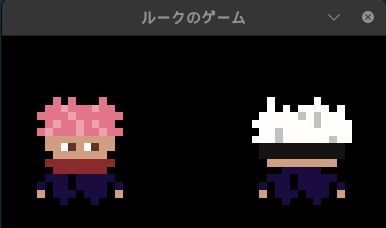
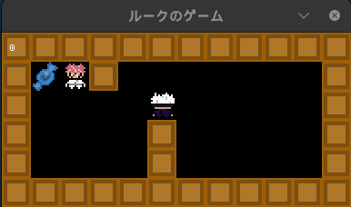

# So_Long Project Readme

## Overview

Welcome to the So_Long project! So_Long is a simple 2D game implemented in C using the MinilibX graphics library. The goal of the game is to navigate through a map, collect items, and reach the exit while avoiding obstacles. It's a great project for learning and practicing graphics programming in C.

## Features

- Basic game mechanics (player movement, item collection, and exit reaching).
- Dynamic rendering with the MinilibX library.
- Support for different maps and levels.

## The Basics

To compile the So_Long project, follow these steps:

1. Clone the repository to your local machine:

   ```bash
   git clone https://github.com/lukeslater0961/so_long.git
   ```

2. Then enter the project's directory and type
   ```code
   make
   ```
3. After making the project you can start it by typing ```./so_long``` and the .ber file for the map, here's an example of what it should look like ```./so_long map.ber```
4. Make sure before that you launch that your map is correct, you should have a map with 1 as walls C as the collectible (there has to be at least one) a P for the player, 0 represent the floor and E the exit.
#Here's an example
```
111111111111
1CE100000001
10000P000001
100001000001
100001000001
111111111111
```
5. Once you've met all the following requirements, so_long should start up and look like this (example represents map shown above):





6. When u start up the program you'll have the choice in between two characters and with them come different collectible looks to select either character press 1 or 2 on your keyboard then the playable window will pop-up.



7. Now you can wonder around using wasd :D
8. Now that you understand how to make things work you can now let your mind roam free , u can design the map YOU want just as long as it follows the criteria that have been set, have fun :D

@lslater
